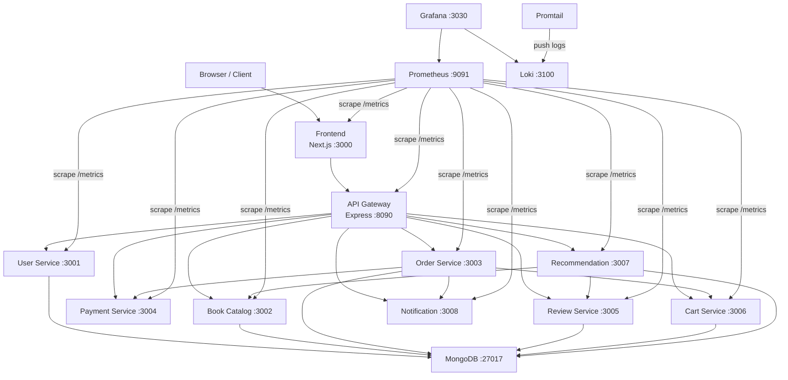

# Architecture Overview

## System Diagram

## Services & Ports

| Service | Port | Description |
|---|---|---|
| Frontend | 3000 | Next.js UI |
| API Gateway | 8090 | Single entry point, JWT auth, proxies to services |
| User Service | 3001 | Auth: signup, login, JWT issuance |
| Book Catalog | 3002 | CRUD for books |
| Order Service | 3003 | Order lifecycle, calls payment + notification |
| Payment Service | 3004 | Payment processing (mock) |
| Review Service | 3005 | Book reviews |
| Cart Service | 3006 | Shopping cart |
| Recommendation | 3007 | Book recommendations based on reviews |
| Notification | 3008 | Email/event notifications (mock) |
| MongoDB | 27017 | Shared database |
| Prometheus | 9091 | Metrics collection |
| Grafana | 3030 | Dashboards & visualization |
| Loki | 3100 | Log aggregation |

## Tech Stack

| Layer | Technology |
|---|---|
| Frontend | Next.js 14, TypeScript, Tailwind CSS, shadcn/ui |
| Backend | Node.js, Express.js |
| Database | MongoDB 7 (Mongoose ODM) |
| Auth | JWT (jsonwebtoken + bcryptjs) |
| Containerization | Docker, Docker Compose |
| Orchestration | Kubernetes (K8s) |
| CI/CD | GitHub Actions |
| Metrics | Prometheus + prom-client |
| Visualization | Grafana |
| Log Aggregation | Loki + Promtail |
| Ingress | NGINX Ingress Controller |

## Communication Pattern

- All external traffic enters through the **API Gateway**
- The API Gateway validates JWT tokens for protected routes
- Services communicate directly via Docker DNS / K8s DNS
- MongoDB is shared but each service uses its own collection
- Prometheus scrapes `/metrics` from every service every 10s
